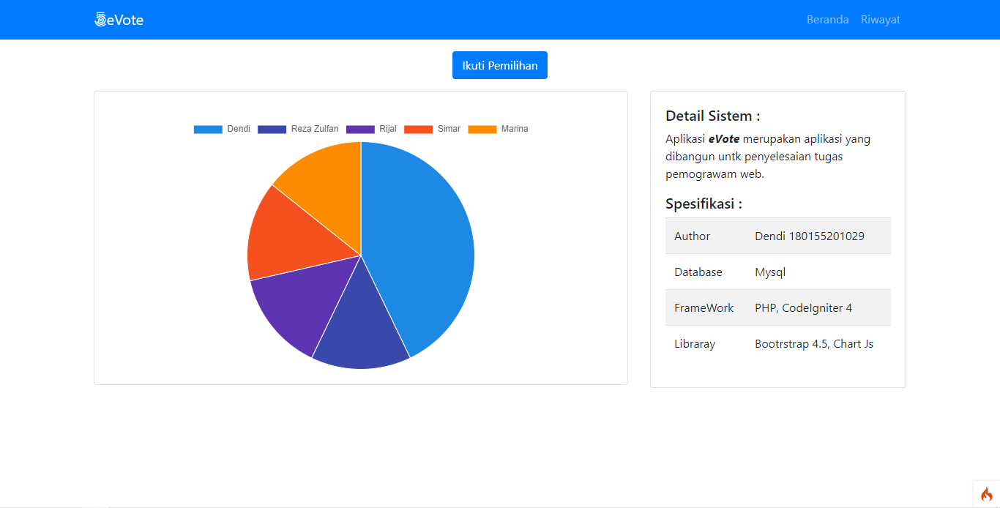
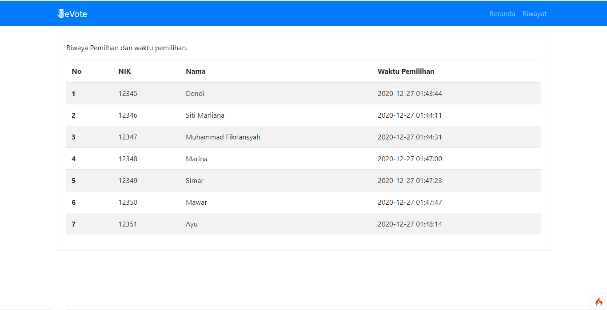

## eVote

Aplikasi ini merupakan aplikasi yang dikembangankan untuk memenuhi kebutuhan tugas pemoraman web.
Aplikasi di bangun menggunkan bahasa `php` framework `CodeIgniter 4`. Aplikasi menggunakan Library `Chart js` dan `bootstrap 4.5` sebagai library.

## Menjalankan Aplikasi

1. Clone Coding dengan melakukan perintah
   > git clone <nama repisitory>
2. Lakukan update Composer
   > Composer Update
3. Import database yang tersedia, database memiliki nama `evote.sql`
4. Jalankan Secara Local Server dengan perintah
   > php spark serve

## Interface

